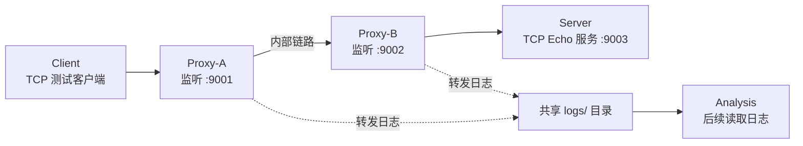

# 搭建稳定、可复现、可记录日志的正常TCP双代理环境

## 目标拓扑



## 验收标准

1. 一条命令启动 4 个节点；
2. Client 向 Proxy-A 发送 `hello network`；
3. 数据经 Proxy-A、Proxy-B 到达 Server；
4. Server 原样回传；
5. Client 收到 `hello network`；
6. `logs/` 下出现 Proxy-A 和 Proxy-B 的 CSV 日志；
7. 关闭后再次启动，整个过程仍可复现。

```tex
docker-compose.yml
Dockerfile
proxy.py
echo_server.py
client.py
logs/
README.md
```

## 项目

### 项目目录

```tex
tcp-lab/
├─ compose.yaml
├─ Dockerfile
├─ proxy.py
├─ echo_server.py
├─ client.py
├─ requirements.txt
├─ logs/	# .gitkeep空文件，让目录提交到git
└─ README.md
```

## compose.yaml

定义全部节点、内部网络和日志共享目录

```tex
四个节点的绑定关系：
Client 只能找到 Proxy-A
Proxy-A 能找到 Proxy-B
Proxy-B 能找到 Server
```

### Dockerfile

创建一个包含python和项目代码的可运行环境

```dockerfile
FROM python:3.11-slim

WORKDIR /app

COPY . /app

CMD ["python", "--version"]
```

python环境 + 容器app目录 

### 实现普通TCP Echo Server-echo_server.py

验证数据是否能穿过整个双代理链路并原样返回

### 实现带日志的普通TCP转发代理-proxy.py

* 接收TCP连接
* 建立到下一节点的新连接
* 双向、透明地转发字节
* 记录每次转发的数据长度与时间间隔

### 实现测试客户端-client.py

由于docker拉取hub的python镜像有误，故暂时采用原生python

#### 基础链路可通


#### 新增批量测试客户端-batch_client.py

* 固定长度循环：64、128、256、512、1024 字节；
* 一次连接内连续 256 次收发；
* 每次等待 Echo 返回，确保不丢失数据；
* 每个事件间隔 20 ms；
* Client 自己也生成一份“期望发送记录”。

#### 每次实验单独建立日志记录

1D-CNN 训练所需的负样本：

| 项目           | 结果                                |
| -------------- | ----------------------------------- |
| 实验编号       | `baseline_lenmix_v1`                |
| 应用层发送次数 | 256                                 |
| Client 校验    | 256/256 成功                        |
| Proxy-A 事件数 | 正向 256，反向 256                  |
| Proxy-B 事件数 | 正向 256，反向 256                  |
| 数据长度       | 64、128、256、512、1024 字节循环    |
| 网络拓扑       | Client → Proxy-A → Proxy-B → Server |
| 实验环境       | Ubuntu 20.04 VMware 原生多进程      |

```tex
baseline_lenmix_v1 ——小数据块流量
|--client_events.csv
|--proxy_a_events.csv
|--proxy_b_events.csv
```

