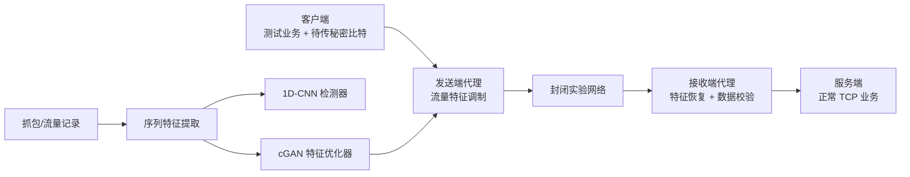
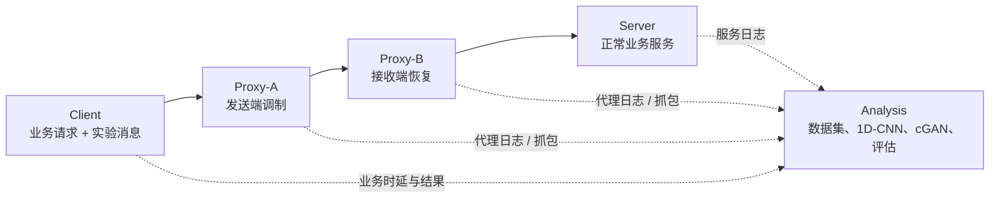

# 基于代理转发与1D-CNN/cGAN的授权TCP流量隐写及可检测性评估研究

**目标**：在封闭授权的实验环境中，研究**代理转发场景下**的**TCP流量特征调制**、**秘密数据可靠传输及其可检测性**；**用1D-CNN建立检测器**，**用cGAN优化特征分布**，并量化容量、可靠性、性能与可检测性的权衡。

## 总体架构



## 实验环境

| 节点     | 建议配置                    | 职责                                 |
| -------- | --------------------------- | ------------------------------------ |
| Client   | Windows/Linux + Python      | 产生正常 HTTP/TCP 请求、提供测试消息 |
| Proxy-A  | Linux + Python/Go           | 客户端侧转发、实施特征调制           |
| Proxy-B  | Linux + Python/Go           | 服务端侧转发、特征恢复、校验         |
| Server   | Linux + Nginx/自建 TCP Echo | 提供稳定正常业务                     |
| Analysis | Python + PyTorch            | 抓包解析、训练和评估                 |



### Docker Compose 搭建

Docker是把程序及其运行环境封装成“容器”的工具，容器是轻量、可复现的独立运行环境

Docker Compose 是 Docker 自带的多容器编排工具：你用一个 `compose.yaml` 文件描述 Client、Proxy-A、Proxy-B、Server、Analysis 分别用什么镜像、如何联网、开放哪些端口、挂载哪些日志目录，然后一条命令统一启动整个实验环境。


### 一个具体实验例子

假设你们搭建一个“下载文本文件”的实验业务：

- Client：模拟浏览器或 Python 测试程序，向服务端请求一份文本文件。
- Server：提供普通 HTTP 文件下载服务。
- Proxy-A：Client 的上游代理。它接收 Client 的正常请求和实验消息。
- Proxy-B：Server 一侧代理。它把流量继续转给 Server，同时从实验特征中恢复消息。
- Analysis：独立运行在另一台电脑或同一台电脑的另一个容器中，只负责记录和分析。

通信过程可以理解为：

1. Client 向 Proxy-A 发起“下载 `report.txt`”的普通请求。
2. Proxy-A 把请求转发给 Proxy-B，Proxy-B 再转发给 Server。
3. Server 返回文件内容，数据沿相反方向回到 Client。
4. 在这个正常转发过程中，Proxy-A 按实验规则控制部分应用层数据块的写入长度，例如把一个可拆分的数据块写成“较短等级”或“较长等级”。
5. 这些长度等级对应实验消息中的 0 或 1。
6. Proxy-B 记录自己观察到的代理转发块长度，并按双方事先约定的规则恢复比特。
7. Client 仍然能正常获得 `report.txt`；Server 也只是在提供正常服务。
8. Proxy-A、Proxy-B 同时写出实验日志，Analysis 读取日志和抓包数据，制作训练集。

这里的边界很重要：实验消息只在你们的封闭、授权网络中传递；Server 不需要知道实验消息的存在；它只处理正常 TCP 业务。

## 隐写载体与边界

**隐写 VS 加密**：加密是看到通信内容无法解读，隐写是观察者不容易发现额外的秘密通信

**载体**：承载实验消息的正常通信特征

对TCP流量：

| 特征           | 含义                       | 本项目是否建议首期使用 |
| -------------- | -------------------------- | ---------------------- |
| TCP 头字段     | 序列号、确认号、标志位等   | 不建议                 |
| 应用层写入长度 | 一次写入代理缓冲区的数据量 | 建议                   |
| 包长度序列     | 网络中观测到的各包长度     | 可用于验证             |
| 发送间隔       | 相邻事件的时间差           | 后期扩展               |
| 连接行为       | 请求次数、方向、持续时间   | 主要用于检测特征       |

应用层可控行为形成的TCP序列特征

1. **发送数据块的长度分组**（推荐：代理层可控制的数据块写入长度）
2. 应用层分块之间的受限发送间隔
3. 已建立连接中的请求节奏
4. 经代理转发时的缓存释放粒度

基本思想：

1. 秘密数据转换为比特流
2. 分帧、加同步字、加入长度和校验
3. 每个比特映射为两类允许的“应用数据块长度区间”
4. 接收端代理根据记录到的块长度恢复比特
5. 校验失败时记录误码，不采用破坏正常TCP连接的重传机制

例子：

假设 Proxy-A 每发送一个“编码单元”，可从两个长度等级中选择：

等级 L：约 800 字节 → 代表比特 0
等级 H：约 1200 字节 → 代表比特 1

若要在实验中表达 `101`：

1 → 写入约 1200 字节
0 → 写入约 800 字节
1 → 写入约 1200 字节

Proxy-B 根据观测到的长度等级恢复 `101`。

不过真实网络有缓冲、TCP 分段和合包，Proxy-B 未必总能在网络包层面看到恰好 800 或 1200 字节。因此第一版应以**Proxy-A 和 Proxy-B 的应用层事件日志**为主要依据，并用抓包验证“网络侧是否仍保留可观测差异”。

## 通信协议设计

| Preamble | Version | Frame ID | Payload Length | Payload | CRC-16 |

| 字段                             | 建议                                                |
| -------------------------------- | --------------------------------------------------- |
| Preamble                         | 32 bit，用于帧同步-告诉B一帧开始了                  |
| Version                          | 4 bit，便于后续扩展                                 |
| Frame ID                         | 16 bit，记录帧序号                                  |
| Payload Length                   | 16 bit-告诉B接下来读多少数据                        |
| Payload                          | 64–512 byte/帧，初期从小开始-此为实验中要传输的内容 |
| CRC（循环冗余校验-判断是否正确） | CRC-16 或 CRC-32-验证这一帧是否正确恢复             |

实现顺序：

1. 先完成普通 TCP 转发。
   证明网络基础功能正确。
2. 再完成“单个比特”编码与恢复。
   证明载体可用。
3. 再完成短的固定消息。
   证明多个比特能连续恢复。
4. 再加入同步字。
   解决接收端从哪里开始读的问题。
5. 再加入长度字段。
   解决消息有多长的问题。
6. 最后加入 CRC。
   解决如何判断是否恢复正确的问题。

## 代理模块设计

先使用显式双向转发代理，直接Client-ProxyA-ProxyB-Server

project/
├─ proxy/
│  ├─ sender_proxy.py        # 接收客户端流量、执行调制
│  ├─ receiver_proxy.py      # 恢复特征、转发服务端
│  ├─ framing.py             # 分帧、同步、CRC
│  ├─ scheduler.py           # 块长度/时间调度
│  └─ config.yaml
├─ collector/
│  ├─ capture.py             # 抓包或代理日志采集
│  ├─ parser.py              # 五元组和序列特征提取
│  └─ dataset_builder.py     # 构建训练数据集
├─ models/
│  ├─ cnn_detector.py        # 1D-CNN
│  ├─ cgan.py                # 条件 GAN
│  ├─ train_detector.py
│  └─ train_cgan.py
├─ evaluation/
│  ├─ metrics.py
│  ├─ baseline_tests.py
│  └─ report_plots.py
├─ docker-compose.yml
└─ README.md

代理日志：

* 会话ID
* TimeStamp
* 每次应用层写入长度
* 方向
* 帧编号
* 编码比特和恢复比特
* CRC是否通过
* 请求耗时、连接状态与异常原因

## 数据集设计

至少有：每个样本建议定义为一个固定窗口内的流量特征序列，例如连续 64 或 128 个事件。

| 类别           | 含义                         | 作用         |
| -------------- | ---------------------------- | ------------ |
| Normal         | 正常代理转发流量，无秘密数据 | 检测器负样本 |
| Baseline-Stego | 基础规则调制后的流量         | 评估基础方案 |
| GAN-Stego      | 经 cGAN 优化后的调制流量     | 评估改进效果 |

特征可以从简单且可解释的开始：

[方向, 数据块长度, 相邻发送间隔, 累积字节数变化]

预处理：

* 长度截断和归一化
* 时间间隔取对数和归一化
* 不足窗口补零、并使用掩码
* 按’会话‘划分训练集、验证集、测试集，禁止同一连接的数据同时进入训练集和测试集

## 1D-CNN

**流量检测者**：判断流量窗口**是正常流量还是实验调制流量**

先实现基础隐写
        ↓
采集正常流量 / 基础隐写流量
        ↓
训练 1D-CNN 检测器
        ↓
训练 cGAN 生成更接近正常分布的候选特征
        ↓
将候选特征约束为代理实际可执行的策略
        ↓
重新由 1D-CNN 和传统模型检测
        ↓
比较优化前后的 AUC、F1、误码率、时延

输入: [batch, 4, 128]
Conv1D(4 → 32, kernel=5)
BatchNorm + ReLU + MaxPool
Conv1D(32 → 64, kernel=5)
BatchNorm + ReLU + GlobalAveragePooling
Dropout
Linear(64 → 2)

| 项目       | 建议初值                                 |
| ---------- | ---------------------------------------- |
| 窗口长度   | 64 或 128                                |
| batch size | 32 或 64                                 |
| 优化器     | Adam                                     |
| 学习率     | 0.001                                    |
| 损失函数   | Cross Entropy                            |
| 训练轮数   | 30–100，配合早停                         |
| 评价指标   | Accuracy、Precision、Recall、F1、ROC-AUC |

## cGAN

**流量优化者**：让cGAN为不同秘密比特生成或推荐受约束的特征扰动

## 对照试验矩阵

| 组别 | 调制方式              | 用途           |
| ---- | --------------------- | -------------- |
| A    | 正常转发，不携带数据  | 基线           |
| B    | 固定规则长度调制      | 基础隐写       |
| C    | 随机化长度调制        | 验证随机化效果 |
| D    | cGAN 辅助调制         | 验证核心创新   |
| E    | 仅时间间隔调制，可选  | 扩展对比       |
| F    | 长度 + 时间组合，可选 | 后续升级       |

每个组在不同条件下重复测试：

- 无背景流量；
- 存在背景流量；
- 不同 RTT；
- 不同带宽限制；
- 轻度丢包或抖动；
- 不同业务负载大小。

## 核心评价指标

通信可靠性：

\[ BER = \frac{\text{错误比特数}}{\text{总比特数}} \]

\[ FER = \frac{\text{错误帧数}}{\text{总帧数}} \]

\[ Throughput_{secret} = \frac{\text{成功恢复的秘密比特}}{\text{总通信时间}} \]

业务性能：

- 平均/95 分位端到端时延；
- 正常业务吞吐下降比例；
- 额外字节开销；
- 代理 CPU、内存占用；
- 连接失败率。

可检测性：

- 检测准确率；
- Precision、Recall、F1；
- ROC-AUC；
- 在固定误报率下的检出率；
- 不同检测器上的平均检测性能。

最终结果不要只报“检测准确率下降”。更有价值的图是：

```
秘密传输速率  ↔  误码率  ↔  业务时延  ↔  检测 AUC
```

它能体现隐写系统的典型权衡，也最符合网络传输方向的研究表达。

## 推荐开发阶段

| 阶段         | 时间        | 交付物                          |
| ------------ | ----------- | ------------------------------- |
| 需求与环境   | 第 1–2 周   | Docker/虚拟机网络、普通转发代理 |
| 基础通信     | 第 3–5 周   | 分帧、编码、恢复、CRC、日志     |
| 基础隐写     | 第 6–8 周   | 固定规则长度调制与 BER 测试     |
| 数据集与检测 | 第 9–12 周  | 数据集、传统模型、1D-CNN        |
| cGAN 优化    | 第 13–17 周 | cGAN、约束投影、GAN-Stego 数据  |
| 对比评估     | 第 18–20 周 | 各种网络条件下的实验数据        |
| 总结展示     | 第 21–22 周 | 论文、答辩 PPT、演示系统        |

## 团队分工

- 成员 A：代理、网络环境、协议分帧与性能测试；
- 成员 B：数据采集、特征工程、数据集管理；
- 成员 C：1D-CNN、传统检测模型和模型评估；
- 成员 D：cGAN、可视化、实验管理、论文与答辩材料。

| 成员                    | 负责内容                                         | 第一阶段交付物                                      |
| ----------------------- | ------------------------------------------------ | --------------------------------------------------- |
| 队员 1：网络与环境      | Docker、五节点拓扑、普通 TCP/HTTP 服务、连通性   | `docker compose up` 后 Client 能经双代理访问 Server |
| 队员 2：代理与协议      | Proxy-A/Proxy-B、分帧、编码恢复、CRC、结构化日志 | 能发送并恢复一段测试文本，输出 CRC 结果             |
| 队员 3：数据与检测      | 日志解析、窗口切分、传统基线、1D-CNN             | 正常/调制二分类数据集和首版检测结果                 |
| 队员 4：cGAN 与实验展示 | 正常特征分布分析、cGAN 原型、可视化、实验记录    | 特征分布图与 cGAN 候选策略原型                      |
| 队长                    | 接口规范、进度、实验设计、代码整合、论文框架     | 项目说明、数据格式规范、每周验收与实验总表          |

| 成员        | 本周任务                                                     | 验收标准                                            |
| ----------- | ------------------------------------------------------------ | --------------------------------------------------- |
| 网络与环境  | 学会 Docker Compose；搭建 Client、Proxy-A、Proxy-B、Server 四容器网络 | 一条普通 HTTP 请求能完整通过双代理                  |
| 代理与协议  | 写出消息帧格式；实现 CRC；用本地函数完成编码—解码测试        | 输入 `HELLO`，输出仍为 `HELLO`，CRC 通过            |
| 数据与检测  | 定义日志字段；用模拟 CSV 生成固定窗口样本；搭建传统分类器模板 | 产生形状为 `[样本数, 4, 128]` 的训练数据            |
| cGAN 与展示 | 调研并复现一个最小条件 GAN；画出“项目闭环”和“实验指标”图     | 能解释 Generator、Discriminator、条件变量分别是什么 |
| 队长        | 建仓库目录、确定接口、建立任务看板和周报模板                 | 每个人知道输入、输出、负责人和截止时间              |

### 项目分成两条线。

第一条是通信线：先保证 Client—Proxy-A—Proxy-B—Server 的正常业务能稳定工作，再实现小容量实验数据的编码、恢复与 CRC 校验。

第二条是分析线：采集正常流量、基础调制流量和优化调制流量，训练检测模型，比较不同方案的误码率、传输速率、额外时延和检测 AUC。

### 阶段性成功标准是：

正常业务不中断；

实验数据可被正确恢复；

能采到可用数据集；

1D-CNN 能完成正常与调制流量的检测；

最后再验证 cGAN 是否能在相近可靠性和性能代价下改善可检测性。