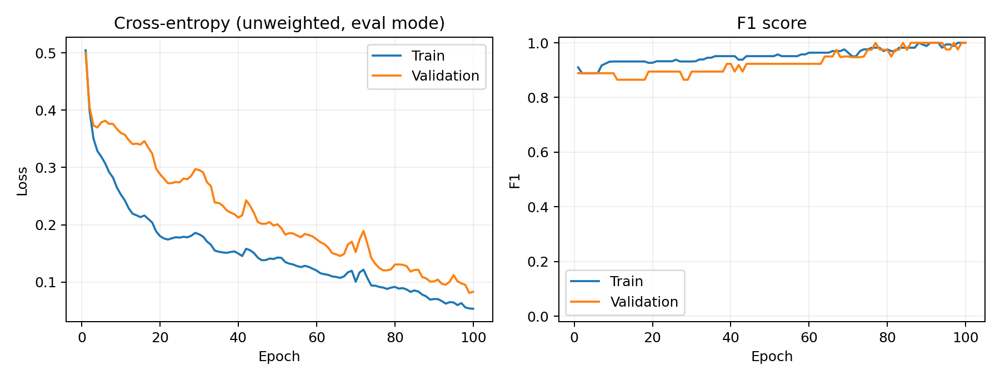
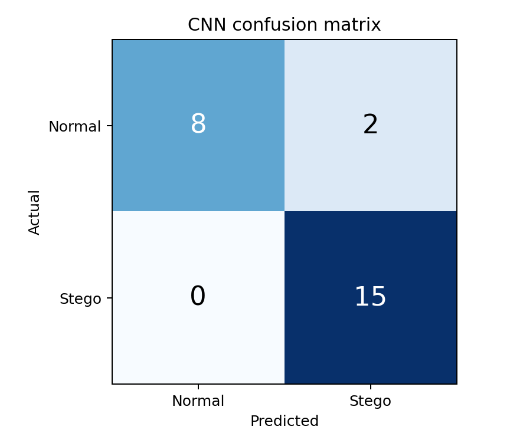
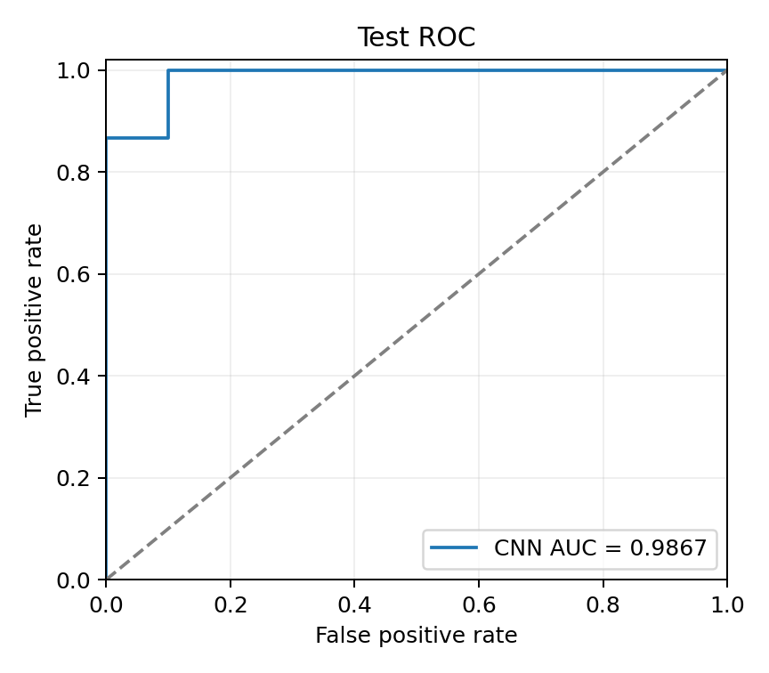

# 1D-CNN 实验结果

本报告由 run_all.py 根据本次运行结果生成。

## 数据

| 集合 | 样本数 | 正常 | 隐写 |
|---|---:|---:|---:|
| train | 117 | 32 | 85 |
| val | 26 | 6 | 20 |
| test | 25 | 10 | 15 |

## 模型与训练

输入为已标准化的 [N,4,128]，输出为正常/隐写两类。
结构：Conv1d(4,32,5,padding=2) → BN → ReLU → MaxPool(2) → Conv1d(32,64,5,padding=2) → BN → ReLU → 全局平均池化 → Dropout(0.3) → Linear(64,2)。
使用 Adam、训练集类别加权交叉熵；按未加权验证集交叉熵最低选择最佳模型。阈值预先固定为 0.5。
运行 100 轮，最佳轮次 99；种子 42。
训练阶段未读取测试集；这里只运行一套预先设定的配置，没有依据测试结果调参。

## 测试集对比

| 模型 | Accuracy | Precision | Recall | F1 | ROC-AUC | TN/FP/FN/TP |
|---|---:|---:|---:|---:|---:|---|
| CNN | 0.9200 | 0.8824 | 1.0000 | 0.9375 | 0.9867 | 8/2/0/15 |
| LogisticRegression | 0.8800 | 1.0000 | 0.8000 | 0.8889 | 1.0000 | 10/0/3/12 |
| Rule8001200 | 0.8800 | 1.0000 | 0.8000 | 0.8889 | — | 10/0/3/12 |

规则检测：出现约 800/1200 字节即预测为隐写；逻辑回归使用四通道的均值、标准差、最小值和最大值，共 16 个统计特征。所有基线只用训练数据拟合，使用相同测试集。

## 结果边界

- 测试集只有 25 个窗口，一个样本对应 4 个百分点准确率。
- 未提供会话索引，无法确认训练/验证/测试是否会话隔离。这是待人工确认事项。
- 数据窗口来自应用层事件，不能把本实验直接写成真实网络抓包上的通用隐写检测。
- 样本标准化方式沿用提供的 scaler：每个窗口展平为 512 维逐位置标准化。
- 方向编码、累计字节数公式及窗口标签来源仍需原预处理脚本说明；模型沿用现有数据，没有擅自更改。
- 未提供 GAN-Stego 数据，未声称验证 GAN 优化效果；接口已实现并完成输入输出一致性检查。
- 本包只负责检测，不计算传输误码率、CRC 成功率或业务时延。

## 图表

